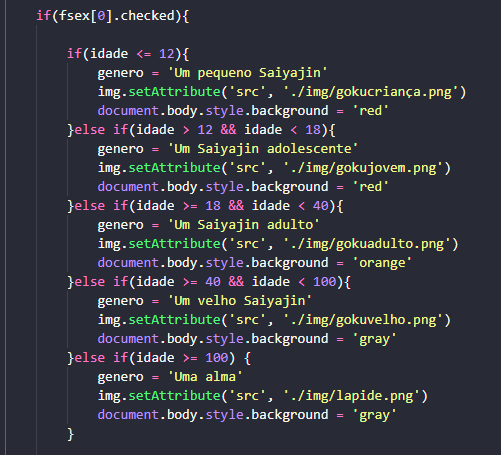
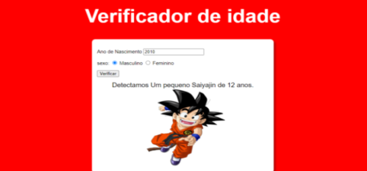

<h1 align="center" > Olá sou um Dev iniciante!</h1>
 

Eu fiz esse pequeno projeto, como resolução de uma atividade passada em uma vídeo aula  do canal <a href="https://www.youtube.com/watch?v=1-w1RfGIov4&list=PLHz_AreHm4dlsK3Nr9GVvXCbpQyHQl1o1 ">Curso em Vídeo</a>, aplicando minhas práticas e adicionando algumas coisa que eram do meu interesse e que me animavam!

 
<h2 align="center" >Técnicas usadas nesse projeto!</h2>
 

Nesse projeto eu fiz o uso das condições do Javascript, para praticar meus conhecimentos já estabelecidos”

 

<h3 align="center" ><strong>Resultado final!</strong></h3>

 
 
<h2 align="center" >Eu te convido a dar um clone no código e dar uma olhada no arquivo index.html e ver o resultado final, te garanto que você irá dar uma risada! <strong>De um star &#x2B50;, para eu saber, que você gostou!</strong> 
</h2>
